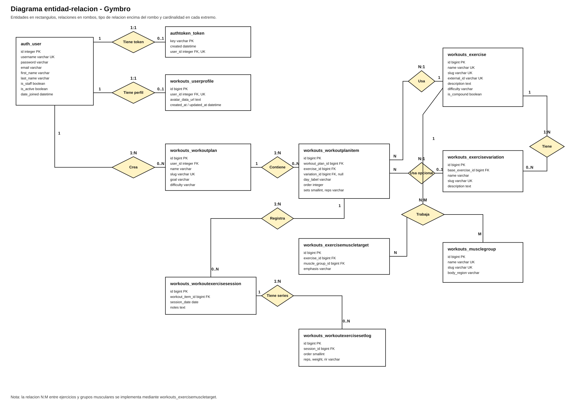

# Diagrama SQL de la base de datos

Este diagrama recoge las tablas principales de Gymbro y las tablas de autenticacion de Django que se relacionan con ellas.

Version descargable con fondo blanco y relaciones en rombos:

- [Abrir vista descargable](database-schema-download.html)
- [Descargar SVG del diagrama](database-chen-diagram.svg)

```mermaid
erDiagram
    AUTH_USER {
        integer id PK
        varchar password
        datetime last_login
        boolean is_superuser
        varchar username UK
        varchar first_name
        varchar last_name
        varchar email
        boolean is_staff
        boolean is_active
        datetime date_joined
    }

    AUTHTOKEN_TOKEN {
        varchar key PK
        datetime created
        integer user_id FK,UK
    }

    WORKOUTS_USERPROFILE {
        bigint id PK
        datetime created_at
        datetime updated_at
        text avatar_data_url
        integer user_id FK,UK
    }

    WORKOUTS_MUSCLEGROUP {
        bigint id PK
        datetime created_at
        datetime updated_at
        varchar name UK
        varchar slug UK
        text description
        varchar body_region
    }

    WORKOUTS_EXERCISE {
        bigint id PK
        datetime created_at
        datetime updated_at
        varchar name UK
        varchar slug UK
        varchar external_id UK
        text description
        text instructions
        varchar equipment
        varchar body_part
        varchar demo_gif_path
        json demo_frame_paths
        varchar difficulty
        boolean is_compound
    }

    WORKOUTS_EXERCISEMUSCLETARGET {
        bigint id PK
        bigint exercise_id FK
        bigint muscle_group_id FK
        varchar emphasis
    }

    WORKOUTS_EXERCISEVARIATION {
        bigint id PK
        datetime created_at
        datetime updated_at
        bigint base_exercise_id FK
        varchar name
        varchar slug UK
        text description
        varchar equipment_override
        text instructions_override
    }

    WORKOUTS_WORKOUTPLAN {
        bigint id PK
        datetime created_at
        datetime updated_at
        integer user_id FK
        varchar name
        varchar slug UK
        varchar goal
        text description
        varchar difficulty
        smallint days_per_week
        smallint estimated_duration_minutes
    }

    WORKOUTS_WORKOUTPLANITEM {
        bigint id PK
        bigint workout_plan_id FK
        bigint exercise_id FK
        bigint variation_id FK
        varchar day_label
        integer order
        smallint sets
        varchar reps
        smallint rest_seconds
        text notes
    }

    WORKOUTS_WORKOUTEXERCISESESSION {
        bigint id PK
        datetime created_at
        datetime updated_at
        bigint workout_item_id FK
        date session_date
        text notes
    }

    WORKOUTS_WORKOUTEXERCISESETLOG {
        bigint id PK
        bigint session_id FK
        smallint order
        varchar reps
        varchar weight
        varchar rir
        varchar notes
    }

    AUTH_USER ||--o| AUTHTOKEN_TOKEN : "tiene token"
    AUTH_USER ||--o| WORKOUTS_USERPROFILE : "tiene perfil"
    AUTH_USER ||--o{ WORKOUTS_WORKOUTPLAN : "crea rutinas"

    WORKOUTS_EXERCISE ||--o{ WORKOUTS_EXERCISEMUSCLETARGET : "trabaja"
    WORKOUTS_MUSCLEGROUP ||--o{ WORKOUTS_EXERCISEMUSCLETARGET : "es objetivo"
    WORKOUTS_EXERCISE ||--o{ WORKOUTS_EXERCISEVARIATION : "tiene variaciones"

    WORKOUTS_WORKOUTPLAN ||--o{ WORKOUTS_WORKOUTPLANITEM : "contiene ejercicios"
    WORKOUTS_EXERCISE ||--o{ WORKOUTS_WORKOUTPLANITEM : "se programa en"
    WORKOUTS_EXERCISEVARIATION ||--o{ WORKOUTS_WORKOUTPLANITEM : "opcionalmente usa"

    WORKOUTS_WORKOUTPLANITEM ||--o{ WORKOUTS_WORKOUTEXERCISESESSION : "registra sesiones"
    WORKOUTS_WORKOUTEXERCISESESSION ||--o{ WORKOUTS_WORKOUTEXERCISESETLOG : "registra series"
```

## Restricciones y relaciones

## Diagrama con relaciones en rombo

He creado una version en SVG con los rombos dibujados de forma explicita, la cardinalidad encima del rombo y la numeracion en los extremos de cada relacion:

Archivo: [database-chen-diagram.svg](database-chen-diagram.svg)

En esta version:

| Relacion | Tipo |
| --- | --- |
| `auth_user` - `authtoken_token` | `1:1` |
| `auth_user` - `workouts_userprofile` | `1:1` |
| `auth_user` - `workouts_workoutplan` | `1:N` |
| `workouts_workoutplan` - `workouts_workoutplanitem` | `1:N` |
| `workouts_workoutplanitem` - `workouts_exercise` | `N:1` |
| `workouts_workoutplanitem` - `workouts_exercisevariation` | `N:1 opcional` |
| `workouts_exercise` - `workouts_exercisevariation` | `1:N` |
| `workouts_exercise` - `workouts_musclegroup` | `N:M`, mediante `workouts_exercisemuscletarget` |
| `workouts_workoutplanitem` - `workouts_workoutexercisesession` | `1:N` |
| `workouts_workoutexercisesession` - `workouts_workoutexercisesetlog` | `1:N` |

| Tabla | Restriccion |
| --- | --- |
| `auth_user` | `username` unico |
| `authtoken_token` | `key` primaria, `user_id` unico |
| `workouts_userprofile` | `user_id` unico, relacion 1:1 con `auth_user` |
| `workouts_musclegroup` | `name` unico, `slug` unico |
| `workouts_exercise` | `name` unico, `slug` unico, `external_id` unico y opcional |
| `workouts_exercisemuscletarget` | combinacion unica `exercise_id + muscle_group_id` |
| `workouts_exercisevariation` | `slug` unico, combinacion unica `base_exercise_id + name` |
| `workouts_workoutplan` | `slug` unico, pertenece opcionalmente a `auth_user` |
| `workouts_workoutplanitem` | combinacion unica `workout_plan_id + day_label + order` |
| `workouts_workoutexercisesetlog` | combinacion unica `session_id + order` |

## Campos con valores controlados

| Campo | Valores |
| --- | --- |
| `workouts_musclegroup.body_region` | `tren_superior`, `tren_inferior`, `core`, `cuerpo_completo` |
| `workouts_exercise.difficulty` | `principiante`, `intermedio`, `avanzado` |
| `workouts_exercisemuscletarget.emphasis` | `principal`, `secundario`, `estabilizador` |
| `workouts_workoutplan.difficulty` | `principiante`, `intermedio`, `avanzado` |

## Tablas internas de Django

Ademas de estas tablas, Django puede crear tablas internas como `django_migrations`, `django_session`, `django_admin_log`, `auth_group`, `auth_permission` y tablas intermedias de permisos. No contienen la logica principal de Gymbro, pero forman parte del sistema de administracion, sesiones y permisos de Django.
